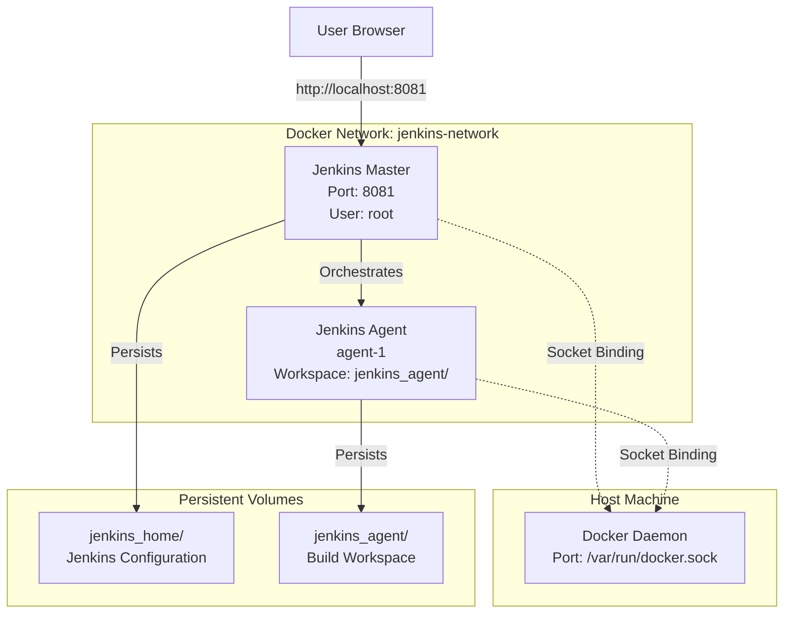
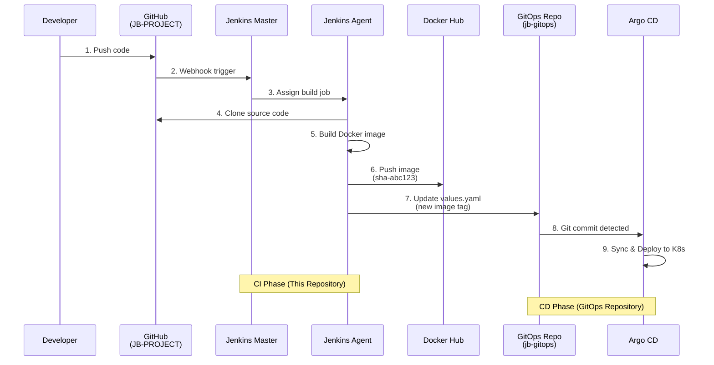
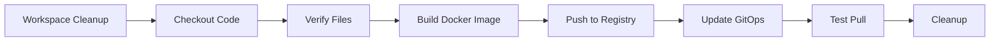
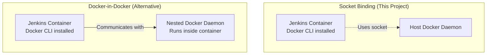
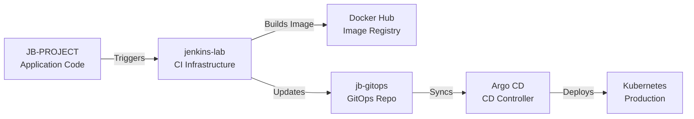

# Jenkins CI Infrastructure - Containerized Setup


## 📋 Overview

A production-ready containerized Jenkins infrastructure for Continuous Integration workflows. This project implements a Jenkins master-agent architecture with Docker integration, designed for automated build and deployment pipelines.

**Infrastructure Components:**
- **Jenkins Master** - Central orchestration and web interface
- **Jenkins Agent(s)** - Distributed build executors
- **Docker Socket Binding** - Build Docker images within pipelines
- **Persistent Storage** - Configuration and build history retention
- **Network Isolation** - Secure container communication

**Key Capabilities:**
- Scalable master-agent architecture
- Docker Compose orchestration
- Pre-configured build tools (Python, Git, Docker CLI)
- Volume persistence for data retention
- CI/CD pipeline execution ready

---

## 🏗️ Architecture



### Component Details

| Component | Purpose | Port | Volume |
|-----------|---------|------|--------|
| **Jenkins Master** | Web UI, Pipeline orchestration | 8081 (HTTP), 50000 (Agent) | `./jenkins_home` |
| **Jenkins Agent** | Build execution, Docker operations | - | `./jenkins_agent` |
| **Docker Socket** | Container build capability | `/var/run/docker.sock` | Host socket |
| **Network** | Isolated container communication | `jenkins-network` (bridge) | - |

---

## 📦 Prerequisites

**Required Software:**

| Tool | Minimum Version | Purpose |
|------|----------------|---------|
| Docker Engine | 20.10+ | Container runtime |
| Docker Compose | 2.0+ | Multi-container orchestration |
| Git | 2.0+ | Version control |

**System Requirements:**
- **RAM**: 4GB minimum (8GB recommended)
- **Disk**: 10GB free space
- **OS**: Linux, macOS, or Windows with WSL2

**Verification Commands:**
```bash
docker --version          # Should show 20.10+
docker compose version    # Should show 2.0+
git --version            # Should show 2.0+
```

---

## 🚀 Quick Start

### 1. Clone Repository
```bash
git clone https://github.com/githuber20202/Compose-with-Jenkins-.git
cd Compose-with-Jenkins-
```

### 2. Launch Infrastructure
```bash
docker compose up -d
```

**Expected Output:**
```
[+] Running 3/3
 ✔ Network jenkins-lab_jenkins-network  Created
 ✔ Container jenkins-master             Started
 ✔ Container jenkins-agent-1            Started
```

### 3. Access Jenkins
Navigate to: **http://localhost:8081**

### 4. Retrieve Initial Password
```bash
docker exec jenkins-master cat /var/jenkins_home/secrets/initialAdminPassword
```

### 5. Complete Setup
1. Paste the initial admin password
2. Install **recommended plugins**
3. Create admin user account
4. Configure Jenkins URL (default: http://localhost:8081)
5. Start building pipelines

---

## 🔄 CI Pipeline Flow



### Pipeline Stages

The included `jenkinsfile` implements a complete CI workflow:



**Stage Breakdown:**

1. **Workspace Cleanup** - Clean previous build artifacts
2. **Checkout** - Clone source code from GitHub (JB-PROJECT)
3. **Verify Files** - Validate required files exist
4. **Build & Push** - Create Docker image with Git SHA tag
5. **Update GitOps** - Modify `values.yaml` in GitOps repository
6. **Test Pull** - Verify image availability
7. **Cleanup** - Remove local Docker images

---

## 📁 Project Structure

```
jenkins-lab/
├── docker-compose.yml      # Service orchestration
├── Dockerfile.jenkins      # Custom Jenkins image
├── jenkinsfile            # CI pipeline definition
├── .gitignore             # Excludes jenkins_home/ and jenkins_agent/
├── jenkins_home/          # Jenkins data (auto-created, gitignored)
├── jenkins_agent/         # Agent workspace (auto-created, gitignored)
└── README.md              # This documentation
```

### File Descriptions

**`docker-compose.yml`**
- Defines Jenkins master and agent services
- Configures network and volume bindings
- Sets environment variables

**`Dockerfile.jenkins`**
- Extends official Jenkins LTS image
- Installs Python, Git, Docker CLI
- Configures build environment

**`jenkinsfile`**
- Complete CI pipeline implementation
- Builds and pushes Docker images
- Updates GitOps repository with new image tags

---

## 🐳 Docker Socket Binding Explained

### Architecture Comparison



### Implementation Details

**Docker CLI Installation** (`Dockerfile.jenkins`):
```dockerfile
RUN curl -fsSL https://get.docker.com -o get-docker.sh && \
    sh get-docker.sh && \
    rm get-docker.sh
```

**Socket Mounting** (`docker-compose.yml`):
```yaml
volumes:
  - /var/run/docker.sock:/var/run/docker.sock
```

### How It Works

1. **Docker CLI** is installed inside Jenkins container
2. **Host Docker socket** (`/var/run/docker.sock`) is mounted as volume
3. Jenkins communicates with **host Docker daemon** via socket
4. Images are built on the **host machine**, not inside container

**Benefits:**
- ✅ Simple setup and configuration
- ✅ Fast builds (uses host Docker cache)
- ✅ Low resource overhead
- ✅ Ideal for development and learning

**Limitations:**
- ⚠️ Security risk: Full Docker access to host
- ⚠️ Not recommended for production environments
- ⚠️ Requires careful permission management

### Comparison Table

| Feature | Socket Binding | Docker-in-Docker |
|---------|---------------|------------------|
| **Setup Complexity** | Simple | Complex |
| **Performance** | Fast (shared cache) | Slower (isolated) |
| **Security** | Lower (host access) | Higher (isolated) |
| **Resource Usage** | Low | High (nested daemon) |
| **Use Case** | Development/Learning | Production |

---

## ⚙️ Configuration

### Environment Variables

The `jenkinsfile` uses the following credentials:

```groovy
environment {
    DOCKER_HUB_REPO = 'formy5000/resources_viewer'
    DOCKER_HUB_CREDS = credentials('dockerhub-credentials')
    GITOPS_REPO = 'https://github.com/githuber20202/jb-gitops.git'
    GITHUB_CREDS = credentials('github-credentials')
}
```

**Required Jenkins Credentials:**

| ID | Type | Purpose |
|----|------|---------|
| `dockerhub-credentials` | Username/Password | Docker Hub authentication |
| `github-credentials` | Username/Password | GitHub repository access |

### Adding Credentials in Jenkins

1. Navigate to **Manage Jenkins** → **Credentials**
2. Select **(global)** domain
3. Click **Add Credentials**
4. Configure:
   - **Kind**: Username with password
   - **Username**: Your Docker Hub / GitHub username
   - **Password**: Your access token
   - **ID**: `dockerhub-credentials` or `github-credentials`

---

## 💡 Usage Examples

### Create Pipeline from Jenkinsfile

1. Open Jenkins UI: http://localhost:8081
2. Click **New Item**
3. Enter name: `CI-Pipeline`
4. Select **Pipeline** → **OK**
5. Under **Pipeline** section:
   - **Definition**: Pipeline script from SCM
   - **SCM**: Git
   - **Repository URL**: `https://github.com/githuber20202/JB-PROJECT.git`
   - **Branch**: `main`
   - **Script Path**: `jenkinsfile`
6. Click **Save** → **Build Now**

### Scale with Additional Agents

Edit `docker-compose.yml`:

```yaml
jenkins-agent-2:
  image: jenkins/inbound-agent:latest
  container_name: jenkins-agent-2
  environment:
    - JENKINS_URL=http://jenkins-master:8080
    - JENKINS_AGENT_NAME=agent-2
    - JENKINS_AGENT_WORKDIR=/home/jenkins/agent
  volumes:
    - ./jenkins_agent_2:/home/jenkins/agent
    - /var/run/docker.sock:/var/run/docker.sock
  depends_on:
    - jenkins-master
  networks:
    - jenkins-network
  restart: unless-stopped
```

Apply changes:
```bash
docker compose up -d
```

### View Logs

```bash
# Jenkins master logs
docker logs -f jenkins-master

# Agent logs
docker logs -f jenkins-agent-1

# All services
docker compose logs -f
```

### Stop Infrastructure

```bash
# Stop containers (preserve data)
docker compose stop

# Stop and remove containers (preserve volumes)
docker compose down

# Remove everything including volumes
docker compose down -v
```

---

## 🔧 Troubleshooting

### Jenkins Won't Start

**Symptoms**: Container exits immediately

**Solutions**:
```bash
# Check port availability
netstat -an | grep 8081  # Linux/Mac
netstat -ano | findstr 8081  # Windows

# Verify Docker is running
docker ps

# Check container logs
docker logs jenkins-master

# Restart Docker service
sudo systemctl restart docker  # Linux
```

### Permission Denied Errors

**Symptoms**: `Permission denied` in logs

**Solution**:
```bash
# Fix ownership (Jenkins uses UID 1000)
sudo chown -R 1000:1000 jenkins_home/

# Windows WSL2
wsl sudo chown -R 1000:1000 jenkins_home/
```

### Agent Connection Issues

**Symptoms**: Agent shows offline in Jenkins UI

**Diagnostics**:
```bash
# Check agent logs
docker logs jenkins-agent-1

# Verify network
docker network inspect jenkins-lab_jenkins-network

# Restart agent
docker compose restart jenkins-agent
```

### Docker Commands Fail in Pipeline

**Symptoms**: `docker: command not found`

**Verification**:
```bash
# Check Docker CLI installation
docker exec jenkins-master docker --version

# Verify socket mount
docker exec jenkins-master ls -la /var/run/docker.sock

# Test Docker access
docker exec jenkins-master docker ps
```

### Disk Space Issues

**Symptoms**: Build failures due to disk space

**Cleanup**:
```bash
# Remove unused Docker resources
docker system prune -a

# Clean Jenkins workspace
docker exec jenkins-master rm -rf /var/jenkins_home/workspace/*

# Check disk usage
docker system df
```

---

## ⚠️ Security Considerations

**⚠️ WARNING: This setup is designed for LEARNING and DEVELOPMENT only!**

### Current Security Limitations

| Issue | Risk Level | Impact |
|-------|-----------|--------|
| Root user execution | 🔴 High | Full container privileges |
| Docker socket mounting | 🔴 High | Host Docker access |
| HTTP only (no TLS) | 🟡 Medium | Unencrypted traffic |
| Default ports | 🟡 Medium | Predictable attack surface |
| No authentication hardening | 🟡 Medium | Basic auth only |

### Production Hardening Checklist

For production deployments, implement:

- [ ] **Non-root user** - Run Jenkins as unprivileged user
- [ ] **Remove Docker socket** - Use Docker-in-Docker or Kaniko
- [ ] **Enable HTTPS** - Configure TLS with valid certificates
- [ ] **Network segmentation** - Implement firewall rules
- [ ] **Secrets management** - Use HashiCorp Vault or AWS Secrets Manager
- [ ] **Audit logging** - Enable comprehensive logging
- [ ] **Regular updates** - Patch Jenkins and plugins
- [ ] **Access control** - Implement RBAC and SSO
- [ ] **Vulnerability scanning** - Regular security audits

### Alternative Build Methods

For production environments, consider:

**Kaniko** - Daemonless Docker builds
```yaml
# No Docker socket required
# Runs in Kubernetes
# Rootless execution
```

**Buildah** - Rootless container builds
```yaml
# No daemon required
# OCI-compliant
# Enhanced security
```

**Docker-in-Docker (DinD)** - Isolated Docker daemon
```yaml
# Complete isolation
# Higher resource usage
# More complex setup
```

---

## 🔗 Related Repositories

This Jenkins infrastructure is part of a complete CI/CD ecosystem:



### Repository Links

| Repository | Purpose | Technology |
|------------|---------|------------|
| [JB-PROJECT](https://github.com/githuber20202/JB-PROJECT) | Application source code | Python Flask |
| [jenkins-lab](https://github.com/githuber20202/Compose-with-Jenkins-.git) | CI infrastructure (this repo) | Jenkins, Docker |
| [jb-gitops](https://github.com/githuber20202/jb-gitops) | GitOps deployment configs | Helm, Argo CD |

### Workflow Integration

**CI Phase (This Repository):**
1. Developer pushes code to JB-PROJECT
2. Jenkins detects change via webhook
3. Pipeline builds Docker image
4. Image pushed to Docker Hub with Git SHA tag
5. Jenkins updates `values.yaml` in jb-gitops repository

**CD Phase (GitOps Repository):**
6. Argo CD detects Git commit in jb-gitops
7. Argo CD syncs Helm chart with new image tag
8. Application deployed to Kubernetes cluster

**Separation of Concerns:**
- **CI (Jenkins)** - Build, test, package
- **CD (Argo CD)** - Deploy, sync, monitor
- **GitOps** - Single source of truth

---

## 📚 Technical Documentation

### Jenkins Pipeline Reference

The `jenkinsfile` implements these stages:

```groovy
pipeline {
    agent any
    
    stages {
        stage('Workspace Cleanup') { ... }
        stage('Checkout') { ... }
        stage('Verify Files') { ... }
        stage('Build & Push with Docker') { ... }
        stage('Update GitOps Repository') { ... }
        stage('Test Pull') { ... }
        stage('Cleanup Docker Images') { ... }
    }
}
```

**Key Operations:**

1. **Git SHA Tagging**
   ```groovy
   env.GIT_COMMIT_SHORT = sh(
       script: "git rev-parse --short HEAD",
       returnStdout: true
   ).trim()
   ```

2. **Docker Image Build**
   ```groovy
   docker build -t ${DOCKER_HUB_REPO}:sha-${env.GIT_COMMIT_SHORT} .
   ```

3. **GitOps Update**
   ```groovy
   sed -i 's/tag: .*/tag: "sha-${env.GIT_COMMIT_SHORT}"/' values.yaml
   ```

### External Resources

- [Jenkins Pipeline Documentation](https://www.jenkins.io/doc/book/pipeline/)
- [Docker Compose Reference](https://docs.docker.com/compose/)
- [Jenkins Master-Agent Architecture](https://www.jenkins.io/doc/book/scaling/architecting-for-scale/)
- [GitOps Principles](https://www.gitops.tech/)

---

## 🤝 Contributing

Contributions are welcome to improve this CI infrastructure.

**How to Contribute:**

1. Fork the repository
2. Create feature branch: `git checkout -b feature/improvement`
3. Commit changes: `git commit -m 'Add improvement'`
4. Push to branch: `git push origin feature/improvement`
5. Open Pull Request with detailed description

**Contribution Guidelines:**

- Follow existing code style
- Update documentation for changes
- Test changes locally before submitting
- Include clear commit messages

---

## 📄 License

This project is licensed under the **MIT License**.

**TL;DR**: Free to use, modify, and distribute, including commercial use, with attribution.

---

## 👤 Author

**Alexander-Y** — DevOps Learning Journey

- GitHub: [@githuber20202](https://github.com/githuber20202)
- Repository: [Compose-with-Jenkins](https://github.com/githuber20202/Compose-with-Jenkins-.git)

---

## 🙏 Acknowledgments

- Jenkins community for comprehensive documentation
- Docker team for containerization technology
- DevOps community for knowledge sharing and best practices

---

**⭐ If you found this project helpful, please star the repository!**

---

## 📖 Quick Reference

### Essential Commands

```bash
# Start infrastructure
docker compose up -d

# View logs
docker compose logs -f

# Stop infrastructure
docker compose down

# Get initial password
docker exec jenkins-master cat /var/jenkins_home/secrets/initialAdminPassword

# Access Jenkins
open http://localhost:8081
```

### Port Mapping

| Service | Internal Port | External Port |
|---------|--------------|---------------|
| Jenkins UI | 8080 | 8081 |
| Agent Connection | 50000 | 50000 |

### Volume Mapping

| Container Path | Host Path | Purpose |
|---------------|-----------|---------|
| `/var/jenkins_home` | `./jenkins_home` | Jenkins data |
| `/home/jenkins/agent` | `./jenkins_agent` | Agent workspace |
| `/var/run/docker.sock` | `/var/run/docker.sock` | Docker socket |

---

*Last Updated: January 2025*
